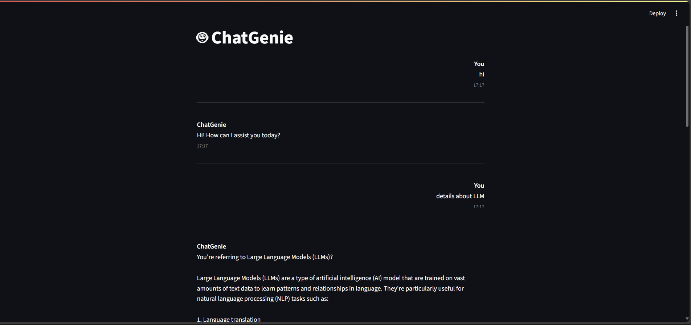

# 🤖 ChatGenie

ChatGenie is an AI chatbot interface powered by Streamlit. It allows users to interact with a chatbot in a browser-based UI. 

## 🌐 How it works

- The app uses the Streamlit framework to create a frontend interface.
- It sends your chat queries to a language model API (GROQ) using the API key stored in the `.env` file.
- Responses are displayed in real-time in the browser.

## 🚀 How to Run

Make sure you have Python installed. Then follow the steps below:

1. **Install Dependencies**

   Open your terminal or command prompt inside the project folder and run:

   ```bash
   pip install -r requirements.txt
   ```

2. **Set Your API Key**

   Create a `.env` file in the same folder and add your API key like this:

   ```env
   GROQ_API_KEY=your_api_key_here
   ```

3. **Run the Chatbot**

   Launch the Streamlit app:

   ```bash
   streamlit run app.py (streamlit run your_script_name.py)
   ```


## 🗂️ Project Structure

```
chatbot/
├── app.py             # Main Streamlit application
├── .env               # API key (not uploaded to GitHub)
├── requirements.txt   # Python dependencies
└── .gitignore         # Prevents .env from being uploaded
```

## 🛑 .gitignore

Make sure the `.env` file is excluded from version control by including this in your `.gitignore` file:

```
.env
__pycache__/
*.pyc
```

## 📝 Notes

- Don't upload `.env` or any secret keys to public repositories.
- Make sure `streamlit` is properly installed; if not, reinstall with `pip install streamlit`.

## 📸 Screenshot 




---

Feel free to contribute or modify the chatbot for your needs!
